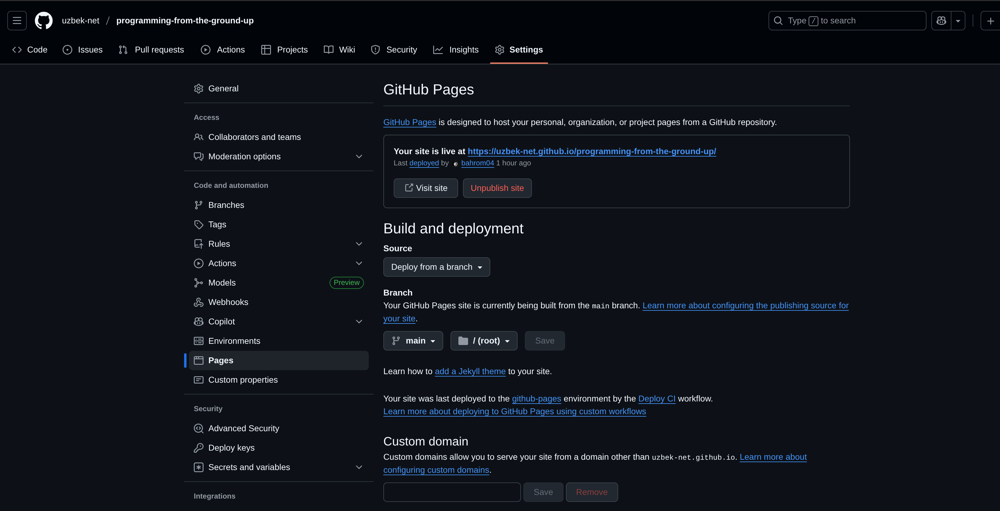
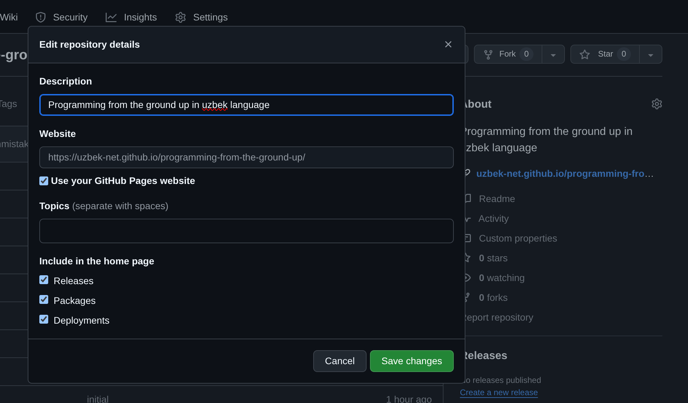

# Rust, MdBook & Nix Template

This is a starter pack for Nix friendly Rust project ecosystem provided to you by Bleur Stack developers. The project uses rust toolchain derived from nixpkgs to fetch necessary tools and then compile your assets.

> Please, after bootstrapping, rename / change all example or template keywords in template files.

# Development

The project has `shell.nix` which has development environment preconfigured already for you. Just open your
terminal and at the root of this project:

```bash
# Open in bash by default
nix develop

# If you want other shell
nix develop -c $SHELL

# if you have direnv (optional)
direnv allow

# Neovim
vim .

# VSCode
code .

# Zed Editor
zed .
```

The development environment has whatever you may need already, but feel free to add or remove whatever
inside `shell.nix`.

In order to start the website in watch mode, run:
```bash
#  Opens: http://localhost:3000
mdbook serve --open
```

## Deploying to github pages

Push your project to github repo. Open repo setting and go to Pages section and set repo branch that your book will build.



Then in Code tab click settings icon and tick true "Use your GitHub Pages website". It will set deployed url website


